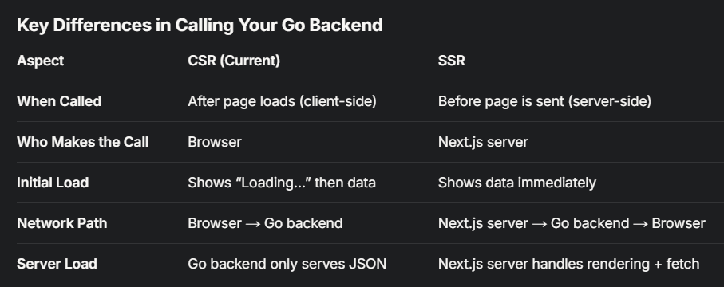
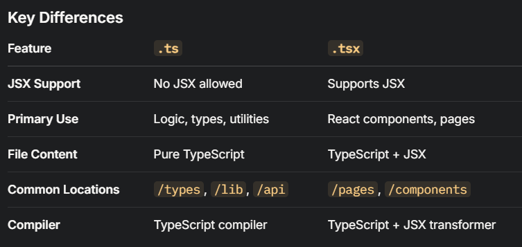

# sealfx

```
npm run dev --turbo
```

Didn't find a good way of decoupling env configuration (the client-side ones!)
from the actual build step of this application, which makes K8s envs not great.
https://stackoverflow.com/questions/59877588/nextjs-and-environment-variables-getting-values-to-client-side

This leads us to maintain .env.local for now...





`NEXT_PUBLIC_`: in Next.js, vars exposed to the browser 
(client-side code, like your fetch in useEffect) must start with NEXT_PUBLIC_. 
without this prefix, the var is only available server-side 
(e.g., in getServerSideProps), which doesn’t work for CSR.


## chart wonkiness

ended up using `(as any)`.

installs that seemed to be working:
```
  "dependencies": {
    "chart.js": "^4.4.9",
    "chartjs-adapter-moment": "^1.0.1",
    "chartjs-plugin-datalabels": "^2.2.0",
    "list": "^2.0.19",
    "moment": "^2.30.1",
    "next": "15.2.4",
    "react": "^19.0.0",
    "react-chartjs-2": "^5.3.0",
    "react-dom": "^19.0.0",
    "react-infinite-scroll-component": "^6.1.0"
  },
```